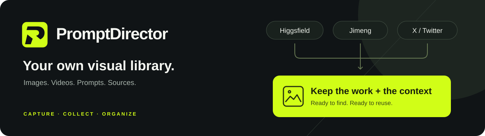

<strong>English</strong> · <a href="README.zh-CN.md">简体中文</a>

<h1 align="center">Keep the image. Keep the prompt.</h1>

<strong>好画面，连同提示词一起收藏。</strong> Collect creative references from Higgsfield, Jimeng, X and more. Keep images, videos, prompts and sources together in your own visual library.

<a href="https://github.com/wchao6891/PromptDirector/releases/latest"><strong>Download the latest release</strong></a> · <a href="https://wchao6891.github.io/PromptDirector-Curated/">Explore curated cases</a> · <a href="#install-and-update">Installation guide</a>

Free & open source · Local first · No account required · Optional AI analysis

## Bring the best of your favorite platforms together

Found a reference worth keeping? Save more than a bookmark. PromptDirector is a Chrome extension with capture adaptations for creative websites and social platforms. It brings the media, text and source available on a page into one case.

| Find inspiration on | Keep it in your library |
| --- | --- |
| **Higgsfield** | Collect work images, videos and creative descriptions to reference a shot or visual approach later. |
| **Jimeng / 即梦** | Collect work media and the original prompt, model and author information provided by the page. |
| **X / Twitter** | Extract post text and image or video references; save prompts shared by the author alongside the work. |
| **More creative websites** | Adaptations also cover LiblibAI, LibTV, Krea, Pinterest and Behance. On other pages, select text, pick images or capture a screenshot. |

**Open a work or post → Start capture with one click → Preview and adjust → Save.**

Capture depends on content the page provides and makes accessible. Original prompts must be shared by their authors; descriptions and AI analysis are not original prompts. Login state, page changes and media access restrictions can affect the result.

Capture does not call AI. Videos are saved locally when possible; supported standalone players and HLS streams can play inside the library. See the [capture guide](docs/CAPTURE_SUPPORT.md) for playback and access boundaries.

## Make your collection useful

| What you want to do | How PromptDirector helps |
| --- | --- |
| **Find a reference visually** | Browse an image-first library, search text and filter by tags to rediscover useful work. |
| **Organize a project** | Arrange cases in nested projects, combine related cases and manage references in batches. |
| **Understand what works** | Connect your own AI service to analyze text, images or videos when you want more context and searchable notes. |
| **Keep your materials together** | Add local images, videos, PDFs, Markdown, TXT, HTML and timestamped video notes. |
| **Share and preserve your work** | Export selected cases or a project subtree as a sharing package. Full folder backups support recovery on another computer; encrypted folder sync supports recovery across your devices. |

The Composer can chat, find cases on request, read selected material, create editable prompts and draft reusable Skills or case tags for your review. It can also check the curated catalog for available versions without downloading packages. Search results stay in the conversation until you choose references; only selected or explicitly requested images are sent to a model. Capturing, organizing and browsing your library do not require an AI service.

## Start with curated references

See the image, read the prompt and save what fits your project. Here are a few examples from the current public collection.

<table>
<tr>
<td width="33%"></td>
<td width="33%"></td>
<td width="33%"></td>
</tr>
<tr><td>Celestial ensemble</td><td>War-tent confrontation</td><td>Foxfire paper shadows</td></tr>
</table>

[Browse the curated library →](https://wchao6891.github.io/PromptDirector-Curated/)

These are curated content previews, not demonstrations of platform capture. Refer to each case's source and rights information before reusing its media.

## Your library stays yours

Cases, media, tags and settings are stored in your current browser by default. No account, ads or usage analytics. AI features are opt-in and use your own service keys; the interface explains what will be sent. Read the [privacy policy](store/PRIVACY_POLICY.md).

## Install and update

**For a local installation, download the `FIXED-ID-DEV` ZIP and load its extracted folder in Chrome or Edge.**

Full installation and in-place update instructions

1. Open the [latest GitHub release](https://github.com/wchao6891/PromptDirector/releases/latest) and download the ZIP with `FIXED-ID-DEV` in its name.
2. Extract the extension files into a permanent folder named `PromptDirector`, without a version number. `manifest.json` must be at the folder's top level.
3. Open Chrome or Edge's extension management page, enable **Developer mode**, select **Load unpacked**, and choose that folder.

The `FIXED-ID-DEV` package keeps the extension's fixed identity. The ZIP without `FIXED-ID-DEV` is for Chrome Web Store submission and omits the manifest key; use the fixed-ID package for local installation. If you previously used a different extension ID, follow the [identity migration guide](docs/EXTENSION_ID_MIGRATION.md).

**Updating an existing local installation:** In Settings, check for updates and select the local upgrade action. On first use, choose and authorize the folder Chrome currently loads. Keep that existing location, even if its name contains an old version. After updating, restart the extension, verify the version in Settings and run the temporary-file cleanup action if shown. Cases and media continue to use the same browser library.

For older versions without the updater, overwrite the program files in the original installation folder with the latest `FIXED-ID-DEV` package, then reload the extension. Keep the existing extension and identity. A routine update does not require uninstalling, exporting or reimporting cases. Source checkouts update through Git.

You can also install through the [Chrome Web Store](https://chromewebstore.google.com/detail/iahakaahijddcjjldidbclicedibgpjm), which manages subsequent updates.

## Contribute and license

Contributions to capture adaptations, interactions, tests and documentation are welcome. When [reporting an issue](https://github.com/wchao6891/PromptDirector/issues), describe the page type, observable behavior and reproduction steps. Remove API keys, private data and unauthorized media from examples. Run `npm run verify` before submitting code.

See the [development guide](docs/DEVELOPMENT.md) and [interface guidelines](docs/DESIGN.md) to contribute.

Code is licensed under [Apache License 2.0](LICENSE). See [THIRD_PARTY_NOTICES.md](THIRD_PARTY_NOTICES.md) for dependencies. The code license does not grant rights to third-party case media.

## Agent access

The optional MCP connector lets an Agent search cases, read original prompts and files, capture requested URLs, and save creative materials. The first connector release supports **macOS Chrome** and requires a separate local installation. Download the `Agent-Connector` asset from Releases and follow the [connector guide](connector/README.md). The extension ZIP alone does not install the connector.
