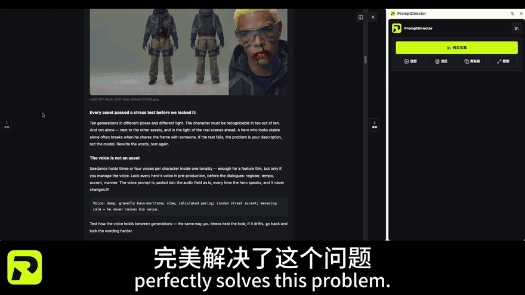
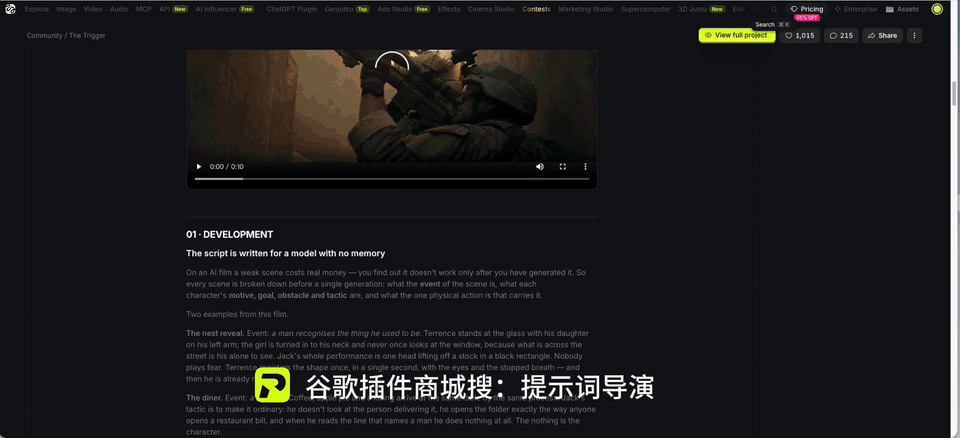
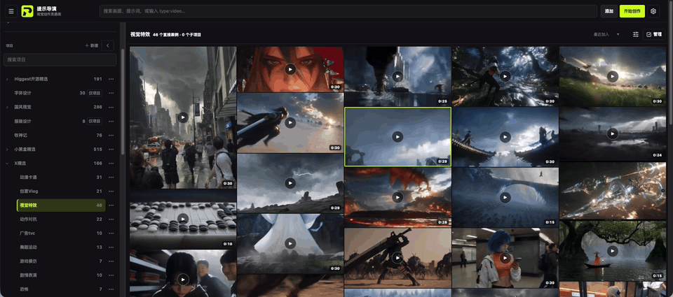
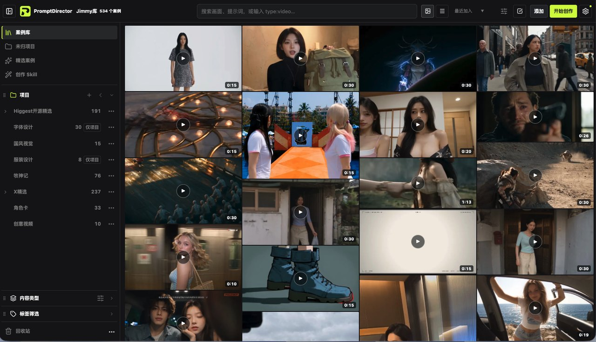
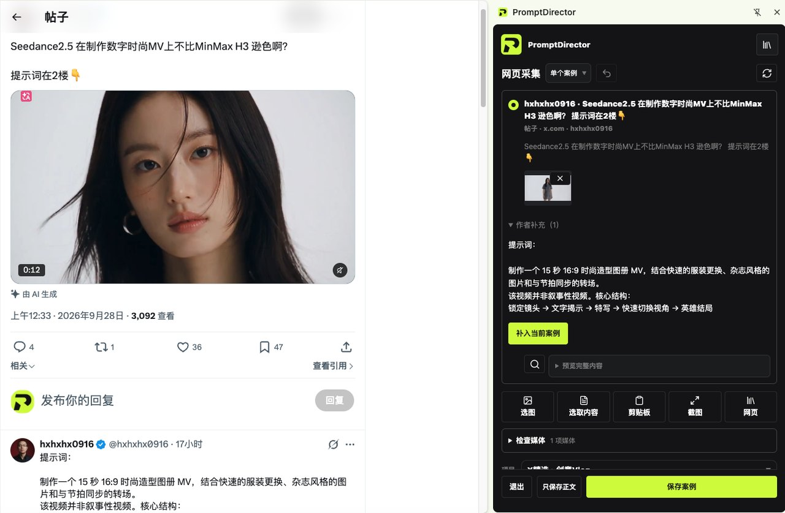
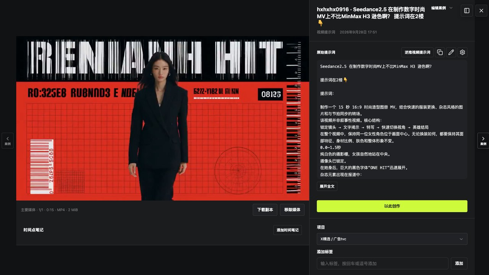
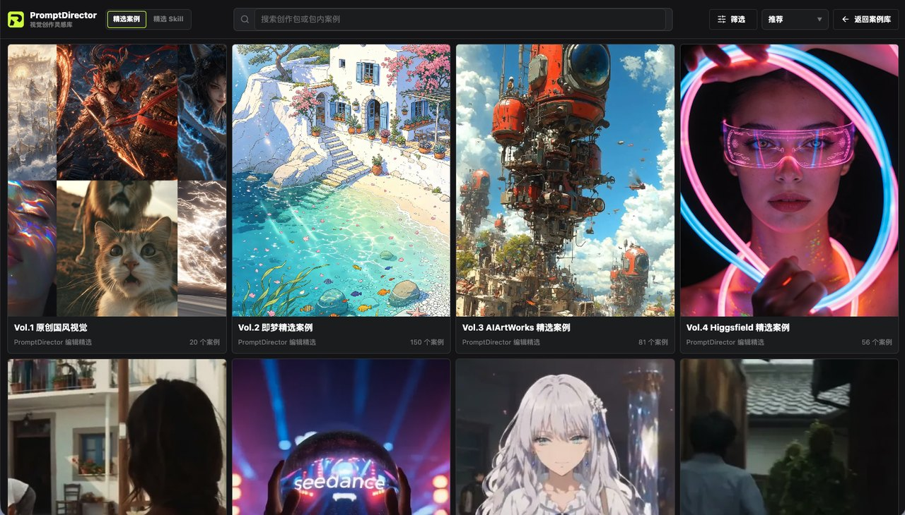
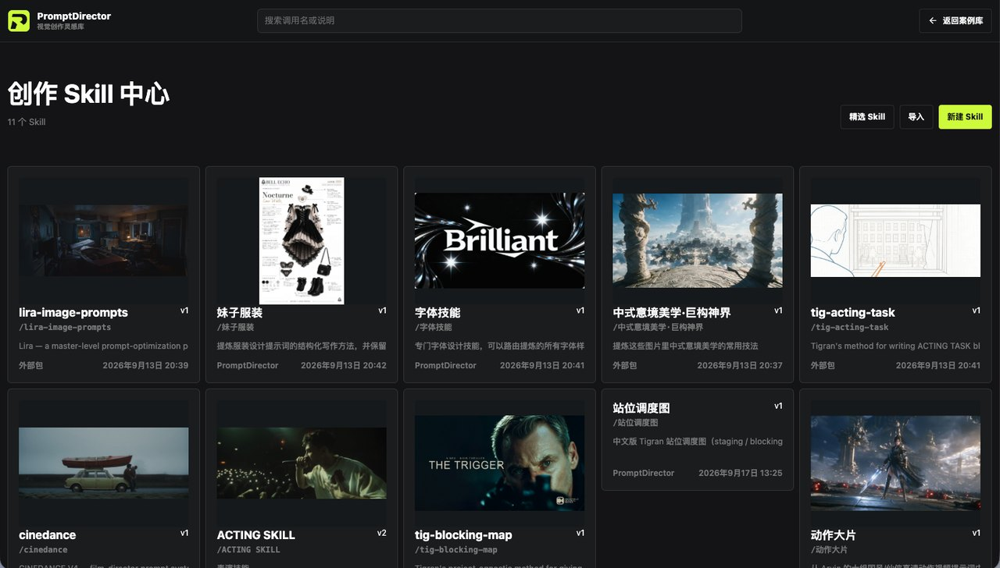
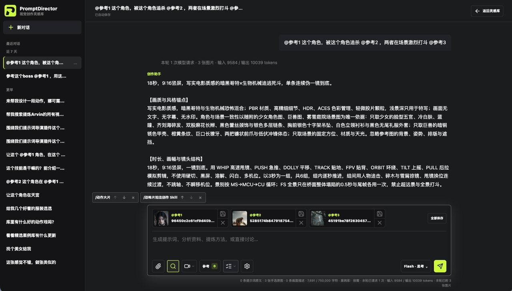

  

<h1 align="center">PromptDirector 提示词导演</h1>

<strong>刷到就存，要用就有</strong> Spot it. Save it.

  
  
  
  

<a href="README.md">English</a> · <strong>简体中文</strong>

  

   
  <a href="https://www.bilibili.com/video/BV1ojeG6UE9t/">▶ 观看 71 秒完整演示（B 站）</a> · <a href="https://www.youtube.com/watch?v=ttbNMJ7Gm7Q">YouTube</a>

- **一键采集，连图带词。** 从即梦、Higgsfield、Midjourney、X、公众号、飞书等 20 多个网站，把作品、视频和公开提示词一起存下。
- **看图找参考。** 图片优先的案例墙，配合标签和项目整理。资料存在本地，无需账号。
- **Agent 随时调用。** Codex、Claude Code、WorkBuddy 可以通过本机 MCP 搜索、读取案例库，并把成果回存进来。

<strong>1000+ 精选案例，一键导入：</strong><a href="https://wchao6891.github.io/PromptDirector-Curated/">浏览精选案例</a> · <a href="https://wchao6891.github.io/PromptDirector-Curated/en/">English</a> · <a href="https://wchao6891.github.io/PromptDirector-Curated/guide.html">快速上手</a>

免费开源 · 本地优先 · 无需账号 · Chrome / Edge（Windows、macOS、Linux）

---

## 看看它怎么用

**1 · 刷到就存。** 打开一篇 Higgsfield 文章，一键采集。提示词导演会把它拆成一个个案例，图片、视频和提示词对应保存进案例库。

**2 · 案例一键变 Skill。** 让创作台在案例库里找出某位作者的动作案例，读完后提炼成可复用的 Skill。

**3 · 动作大片一秒出。** 在创作台混合参考图和 Skill，生成分镜级视频提示词，再交给你常用的模型出片。

<table>
<tr>
<td width="50%"></td>
<td width="50%"></td>
</tr>
<tr><td align="center"><b>案例墙。</b>看图找参考，按项目整理。</td><td align="center"><b>采集 X 帖子。</b>评论区里的提示词也能带走。</td></tr>
<tr>
<td width="50%"></td>
<td width="50%"></td>
</tr>
<tr><td align="center"><b>案例详情。</b>媒体、原始提示词和来源放在一起。</td><td align="center"><b>精选案例。</b>1000+ 案例一键入库。</td></tr>
<tr>
<td width="50%"></td>
<td width="50%"></td>
</tr>
<tr><td align="center"><b>Skill 中心。</b>新建、导入、复用创作技能。</td><td align="center"><b>创作台。</b>参考 + Skill → 直接可用的提示词。</td></tr>
</table>

## 能从哪里采集

**打开作品、帖子或文章 → 一键采集 → 预览勾选 → 保存案例。**

| 灵感来自哪里 | 值得带走什么 |
| --- | --- |
| **即梦 · Higgsfield · LiblibAI · Krea · LibTV** | 作品图片、视频，以及页面公开的提示词和创作信息。把喜欢的画面与创作线索放在一起。 |
| **Midjourney** | 保存当前作品的图片或视频、公开提示词、参数和视频封面；Explore 支持已加载作品预览。 |
| **小黑盒 · 微信公众号** | 收藏整篇图文，也可将结构清晰的多案例文章拆开，勾选其中的图片与对应提示词，分别保存。小黑盒单案例图片墙可与正文提示词成组收藏。 |
| **飞书文档** | 保存正文、长文档和表格内图文，保留单元格位置与合并关系。 |
| **X / Twitter · 小红书 · 微博 · Reddit** | 收集当前帖子正文和可获取的媒体，把作者分享的提示词与作品一起留下。 |
| **Pinterest · Behance · ArtStation · 花瓣 · 站酷** | 收集作品页面的视觉参考，集中浏览、搜索和整理。 |
| **更多网页与本地资料** | 通用网页采集，加上选区、选图、截图和本地文件导入，把分散的资料汇到一个库里。 |

**一篇文章，拆成一组案例。** 遇到十几个案例放在一起的分享帖，可以在「文章内案例」中预览分组，只勾选想要的案例分别入库；也可以保留整篇文章。

**好参考，连同上下文一起留下。** 多图作品保留成组关系，文章保留图文顺序，飞书表格保留布局。图片、正文、原始提示词、来源与后续分析各有位置。

采集、浏览和整理都不需要 AI 服务。页面需要可访问，原始提示词需要作者公开；登录、懒加载和网站变化可能影响结果，保存前可预览核对。详见[网页与媒体采集说明](docs/CAPTURE_SUPPORT.md)。

## 你的眼光选参考，你的 Agent 接着创作

**把案例库交给 Codex、Claude Code、WorkBuddy 使用**：找参考、读提示词、取原件、采集网址、回存创作材料，都能在 Agent 对话里完成。

1. 在插件「设置 → Agent 连接」点击 **复制连接指令**。
2. 粘贴给支持本机 MCP 的 Agent，让它安装连接器、配置并验证。
3. 按提示在插件里启用授权。

> “从我的案例库找几组国风人物海报参考，列出来让我选。”
>
> “读取我选中的案例原图和提示词，参考它们写这次活动的视觉方案。”
>
> “把这次确认的提示词和生成图片存回 PromptDirector。”

其他本机 MCP 客户端可使用通用配置；纯云端工作台不适用此流程。[查看 Agent 安装说明 →](connector/INSTALL.md)

## 越收藏，越有自己的创作资料库

| 你在创作中需要的 | 这里已经准备好 |
| --- | --- |
| **看一眼，就知道想用哪张** | 图片优先的案例墙，配合文字搜索与标签筛选。 |
| **一个项目，一套参考** | 可嵌套项目树、案例组合和批量管理。 |
| **把经验用在下一次** | 创作台可读取选定案例，生成可编辑提示词、提炼可复用 Skill 和标签建议，由你审阅保存。 |
| **图片之外，也装得下资料** | 本地图片、视频、音频、DOCX、PDF、Markdown、TXT、HTML、RTF，以及视频时间点笔记。 |
| **分享给别人，也留给未来的自己** | 导出案例或项目分享包，完整资料夹备份、换电脑恢复和加密文件夹同步。 |

AI 分析按需开启，使用你自己的服务；原图只在你选中或明确指定时才发送给模型。

## 你的资料，由你保管

资料、媒体、标签和设置默认保存在当前浏览器，不需要账号，没有广告，不收集使用统计。AI 功能由你主动开启，使用你自己的服务密钥。详见[隐私政策](store/PRIVACY_POLICY.md)。

## 安装

**推荐：[Chrome 应用商店](https://chromewebstore.google.com/detail/iahakaahijddcjjldidbclicedibgpjm)，之后自动更新。**

从 GitHub 安装（开发者模式）与原位更新

1. 从 [GitHub 最新发布页](https://github.com/wchao6891/PromptDirector/releases/latest) 下载 `PromptDirector-版本号.zip`。
2. 解压到固定的 `PromptDirector` 文件夹（不带版本号），确保 `manifest.json` 位于第一层。
3. 在 Chrome 或 Edge 扩展管理页开启“开发者模式”，选择“加载已解压的扩展程序”，然后选中该文件夹。

**原位更新：** 在“设置”检查更新，点击“升级本地版”。首次需要选择 Chrome 当前加载的安装文件夹并授权，之后会复用这个位置。插件会自动下载、验证、写入新版并重启；案例和媒体继续保存在原资料库中。

## 参与与许可

欢迎提交问题、改善交互、完善采集适配、补充测试与文档。[反馈问题](https://github.com/wchao6891/PromptDirector/issues)时，请说明页面类型、看到的问题和复现步骤；提供示例前请移除 API Key、私人资料和未获授权的素材。提交代码前请运行 `npm run verify`。构建说明见[开发指南](docs/DEVELOPMENT.md)。

代码采用 [Apache License 2.0](LICENSE)，第三方组件见 [THIRD_PARTY_NOTICES.md](THIRD_PARTY_NOTICES.md)。代码许可不授予第三方案例素材的使用权，复用前请查看各案例的来源与授权说明。
